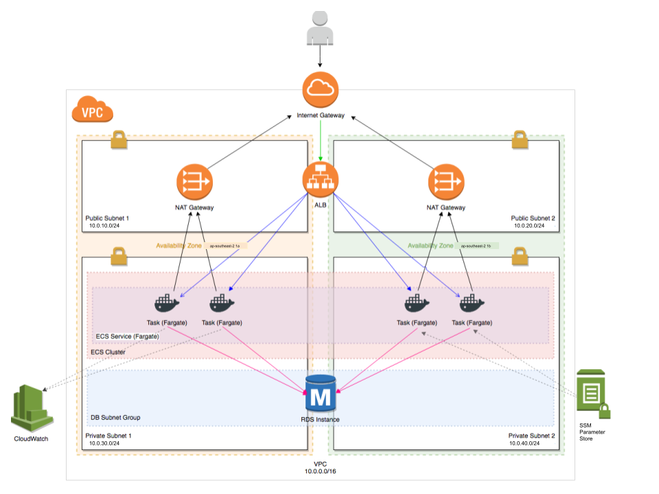
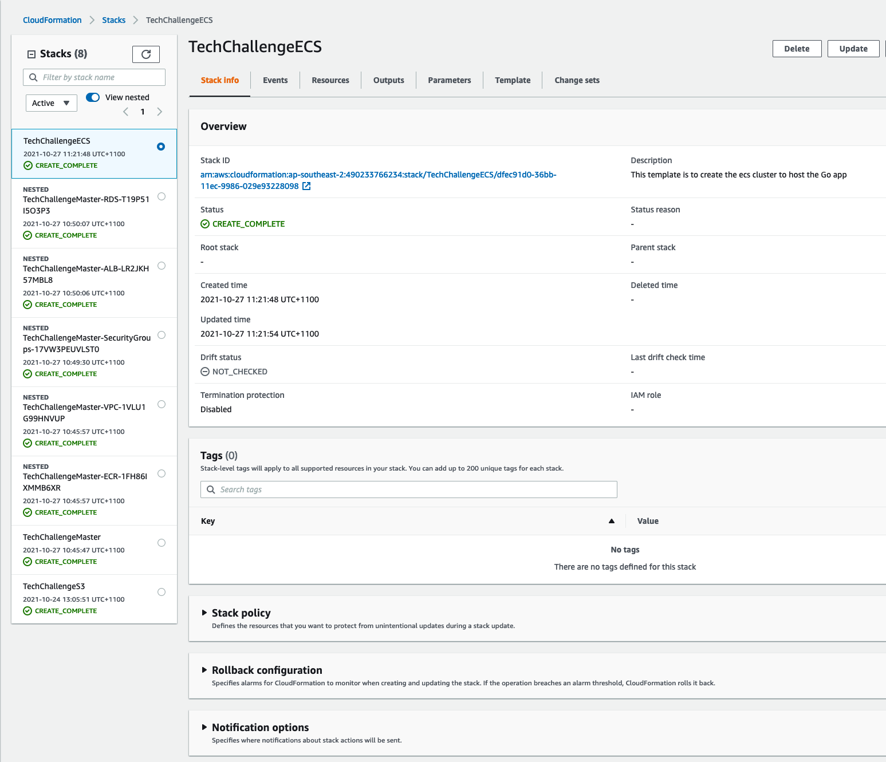
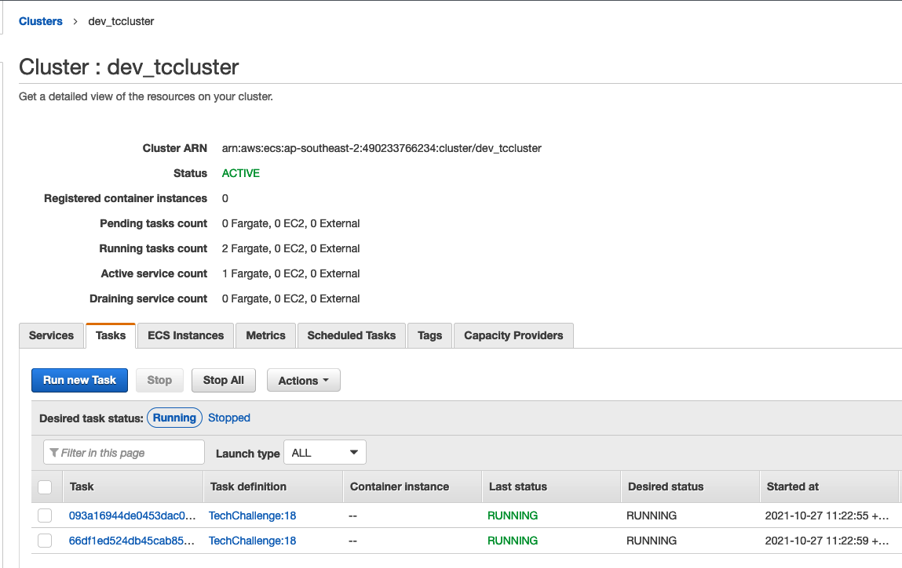
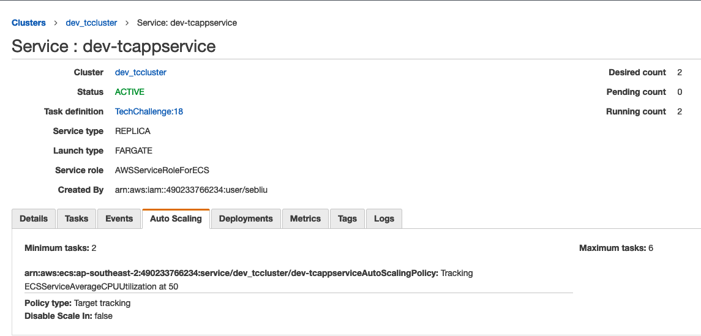
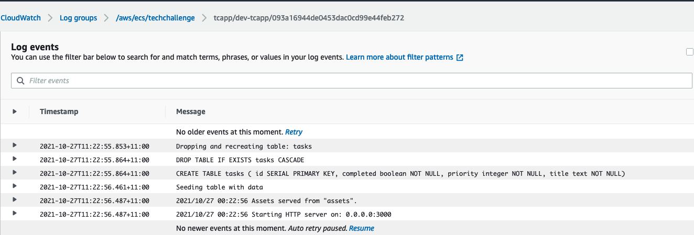
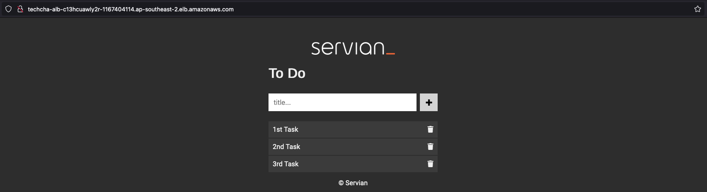

# Description

This README introduces the solutions to deploy Servian TechChallengeApp to AWS public cloud with:
 - Amazon Fargate
 - AWS Cloudformation
 - Application Load Balancer
 - RDS
 - SSM Parameter Store
 - CloudWatch

## High-level Architecture Design Overview

For buiding the basic infrastructure, the CloudFormation nested stack is chosen for a clean, hierarchical purpose.
 
 - A 2-tier VPC with two public and private subnets respectively is created in Sydney(ap-southeast-2) region.
 - Two NAT gateways sitting across two AWS availability zones are to provide outbound internet access for private subnets.
 - The Application Load Balancer deployed across two public subnets, which is accessible from the internet, provides the ability to forward requests to the backend by path-pattern based routing.
 - Three security groups are for Application Load Balancer, ECS Cluster and RDS respectively.
 - A high availability ECS cluster with at least 2 containers running is deployed in the private subnets across two AWS availability zones for hosting Servian TechChallenge Golang app.
 - A Multi-AZ enabled RDS with Postgres engine is deployed in the private subnets.
 - A CloudWatch log group is for logging and monitoring the behavior of the ECS cluster.

Key security ideas in the design:

 - ECS cluster and RDS are strictly inaccessible from publict internet.
 - ECS cluster can take requests from the application load balancer only, but not from other services within the subnets.
 - RDS database is forbidden from being accessed from other services within the subnets except the ECS cluster.
 - Database connecting details (DBUser, DBPassword, DBHost and DBName) are retrieved from SSM parameter store. 

## Why is AWS Fargate

There are several deploy/hosting solutions to choose from:

 - Traditional AWS EC2 with ELB/ALB
 - Dockerised solution by using AWS Fargate
 - AWS ElasticBeanstalk
 - Other cloud providers

First AWS is the only public cloud provider I have experience to deploy applications to.

Comparing the solutions using AWS services, AWS Fargate has the advantage of simplicity, maturity, stability and scalability.

 - AWS EC2 vs AWS Fargate vs AWS ElasticBeanstalk

   By using EC2, the engineer needs to understand how the application works, what the dependencies are. Most likely it would require configuration management tools, like Ansible, Puppet or Chef involved to automate installing processes on EC2 instances.

   By using ECS, it only requies the engineer to build and deploy a docker container to AWS fully managed container service platform, and there are no extra effort needed to look for and install application dependencies. The docker image can be migrated to other container hosting platforms easily, like EKS. Moreover, AWS Fargate provides the ability to scale up or scale down ECS cluster instances based on scaling policies, therefore users only need to configure autoscaling rules for containers.

   By using ElasticBeanstalk, it is indeed benefitial for developers to check development results quickly without too much Ops knowledge, but ElasticBeanstalk is not quite customizable for complex deployment methods.
 
## How to deploy the stack

### Prerequisites

### Deploy Commands

### Outputs Overview

After setting up the prerequisites and then launching the deploy script, jump into AWS Console.

In CloudFormation service, the nested stacks and ECS stack are revealed.

In ECS service, the cluster is created with autoscaling capability.

In CloudWatch service, the initialization processes and requests are logged in the log group.

Finally, once all the stacks are created completely and successfully, the URL to access the Golang application is able to be found in the outputs of the ALB stack.

## CloudFormation Template Details

For more information, see the [Template Run-through](docs/CfnTemplate.md)

## TO-DOs for Optimization

 - Any secrets, like DBPassword, have to be encrypted by choosing secure string type, then decrypted by KMS keys.
 - Implementing CodeBuild and CodePipeline to connect the Github repository via a webhook for setting up a turnkey CI/CD deployment flow.
 - Separating build account and hosting account, which means all the development or build tasks are to be completed in the build account, then the artefact is to be shipped and deployed to the non/prod hosting accounts by a cross-account role. The deployment method is following DevOps best pratice method.
 - Creating a HostZone in Route53 and a CNAME record to link to the URL of the ALB.
 - Creating an SSL listener on ALB and apply a SSL certificate to it for accepting requests via HTTPS.

## Reference Links

Great thanks to [ecs-refarch-cloudformation](https://github.com/aws-samples/ecs-refarch-cloudformation) project to provide me the concepts of deploying the application using AWS Fargate.
